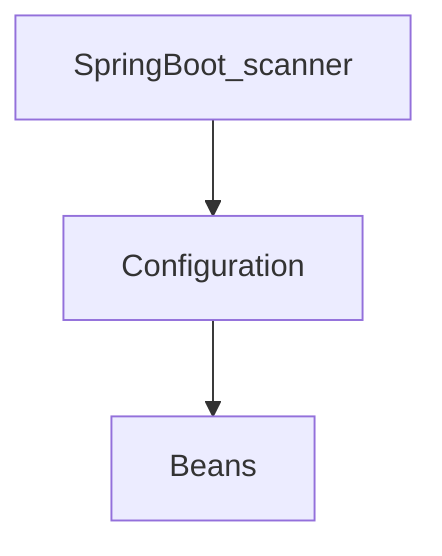
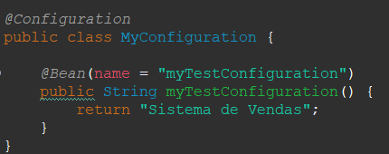
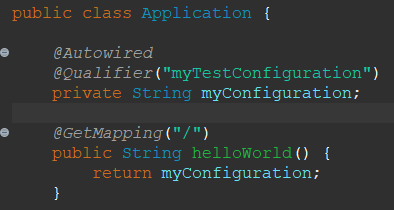
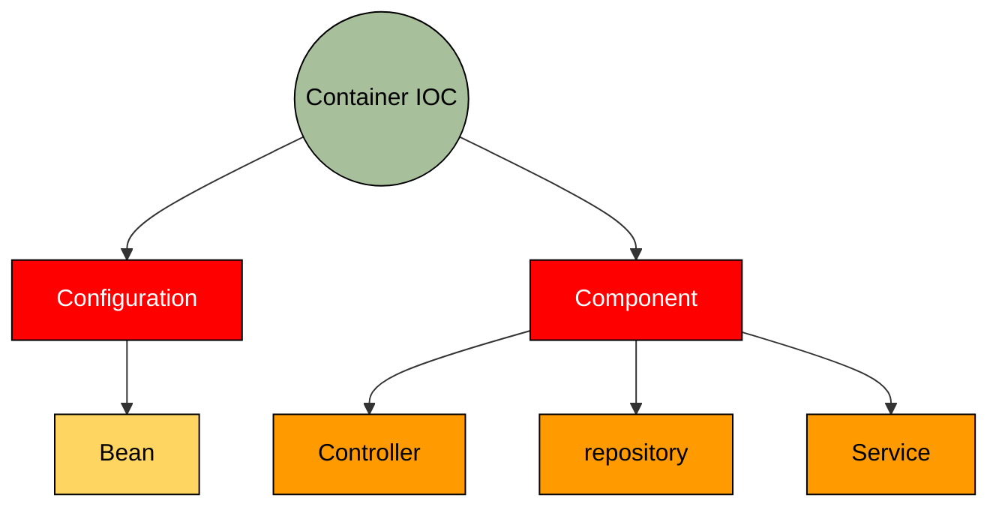

# Curso: Spring Boot Expert: JPA, RESTFul API, Security, JWT


## 🛠 Tecnologias utilizadas

<div style="display: inline_block">
  
  
  
  <!-- -->
</div>

### Tópicos 

- [Descrição do projeto](#descrição-do-projeto)

- [Funcionalidades](#funcionalidades)

- [Deploy da Aplicação](#deploy-da-aplicação-dash)

- [Pré-requisitos](#pré-requisitos)

- [Como rodar a aplicação](#como-rodar-a-aplicação-arrow_forward)

 

Insira os tópicos do README em links para facilitar a navegação do leitor

## Descrição do projeto 

- Projeto desenvolvido no Curso: Spring Boot Expert: JPA, RESTFul API, Security, JWT


## Funcionalidades

### Configurations e Beans







### O Container IOC do Spring Framework
- Container IoC (Inversion of Control)



#### Como funciona o Scan do Spring Boot
- Ele escanear todos os compoentes da aplicação dentro do seu projeto.
- Para que seja escaneado outro arquivo em uma aplicação diferente (de terceiros)
- Utiliza-se a notation *@ComponentScan* que recebe um array com o caminho dos arquivos.
- Colocar no application principal

```
@ComponentScan(
    basePackages = {
        "io.github.teste.repository",
        "br.com.vendas.stg.service"
    }
)
```

### Injeção de Dependências
- No spring existe o *@Autowired* que faz a injeção de depedência automático.
- Existe algumas formas de usar a importação automática
> Direto na variável, sem a necessidade de um construtor

```
@Autowired
private ClientRepository repository;

public void saveClient(Client client) {
    verifyClient(client);
    this.repository.persistence(client);
}
```

> Importação no construtor

```
private ClientRepository repository;

@Autowired
public ClientServices(ClientRepository repository) {
    this.repository = repository;
}

public void saveClient(Client client) {
    verifyClient(client);
    this.repository.persistence(client);
}
```

> Exmplo sem o Autowired

```
private ClientRepository repository;

public ClientServices(ClientRepository repository) {
    this.repository = repository;
}

public void saveClient(Client client) {
    verifyClient(client);
    ClientRepository clientRepository = new ClientRepository();
    clientRepository.persistence(client);
}

```

### Configuração externalizada: Application Properties
> Exemplo
- Nome da aplicação
- Porta para rodar a aplicação
- Raiz da aplicação

```
application.name=Sistema de vendas

server.port=8081
server.servlet.context-path=/sistema-vendas
```

### Configuração externalizada: Application Properties
- Funciona como um .env, só que com uma gama de funcionalidades
- Várias configurações customizadas
- [Application Properties](https://docs.spring.io/spring-boot/docs/current/reference/html/application-properties.html)

### Trabalhando com multiplos ambientes e profiles

## Layout ou Deploy da Aplicação

 


## Pré-requisitos

- Java 8
- Spring Tools 4 for Eclipse


## Como rodar a aplicação

No terminal, clone o projeto: 

```
git clone https://github.com/andresgois/spring-rest.git
```

### Docker 
- docker build -t my-java-app .
- docker run -it --rm --name my-running-app my-java-app

```
FROM jecklgamis/openjdk-8-jre
MAINTAINER Jerrico Gamis <jecklgamis@gmail.com>

ENV APP_HOME /app

RUN groupadd -r app && useradd -r -gapp app
RUN mkdir -m 0755 -p ${APP_HOME}/bin
RUN mkdir -m 0755 -p ${APP_HOME}/config
RUN mkdir -m 0755 -p ${APP_HOME}/logs/

COPY target/spring-boot-java-example.jar ${APP_HOME}/bin
COPY docker-entrypoint.sh /

RUN chown -R app:app ${APP_HOME}
RUN chmod +x /docker-entrypoint.sh

EXPOSE 8080
EXPOSE 8443

WORKDIR ${APP_HOME}
CMD ["/docker-entrypoint.sh"]
```

- [Localhost](http://localhost:8081/sistema-vendas/)
#### Roda Fast Jar
- Botão direito no projeto
- Run as
- Maven Build
- em Goals coloque *clean package*
    - isso limpa tudo e depois empacota a aplicação    

#### Roda o JAR
- entre na pasta target
```
java -jar nome-do-jar.jar
```

## Como rodar os testes

Coloque um passo a passo para executar os testes

```
[code]
```

## SPRING DATA E ACESSO A DADOS

### Configurar e conectar-se a um banco de dados

### Acessar bancos de dados em memória através do browser

### Utilizar SQL junto com o Spring JDBC para fazer operações 

### Mapear entidades JPA e utilizar o EntityManager para realizar as operações de base de dados

### Trabalhar com JPA repositories

### Fazer consultas utilizando Query Methods e @Query


## Casos de Uso

Explique com mais detalhes como a sua aplicação poderia ser utilizada. O uso de **gifs** aqui seria bem interessante. 

Exemplo: Caso a sua aplicação tenha alguma funcionalidade de login apresente neste tópico os dados necessários para acessá-la.

## JSON :floppy_disk:

### Usuários: 

|name|email|password|token|avatar|
| -------- |-------- |-------- |-------- |-------- |
|name|email|password|token|avatar|


## Iniciando/Configurando banco de dados

Se for necessário configurar algo antes de iniciar o banco de dados insira os comandos a serem executados 

## Linguagens, dependencias e libs utilizadas :books:

- [Java](https://docs.oracle.com/en/java/)
- [Spring](https://spring.io/projects)
- [Spring Initializer](https://start.spring.io/)


Liste as tecnologias utilizadas no projeto que **não** forem reconhecidas pelo Github 

## Resolvendo Problemas :exclamation:

Em [issues]() foram abertos alguns problemas gerados durante o desenvolvimento desse projeto e como foram resolvidos. 

## Tarefas em aberto

Se for o caso, liste tarefas/funcionalidades que ainda precisam ser implementadas na sua aplicação

- Tarefa 1 

## Desenvolvedores/Contribuintes :octocat:

Liste o time responsável pelo desenvolvimento do projeto

| [<br><sub>André Gois</sub>](https://github.com/andresgois) |
| :---: 

## Licença 

The [MIT License]() (MIT)

Copyright :copyright: 2022 - Curso: Spring Boot Expert: JPA, RESTFul API, Security, JWT